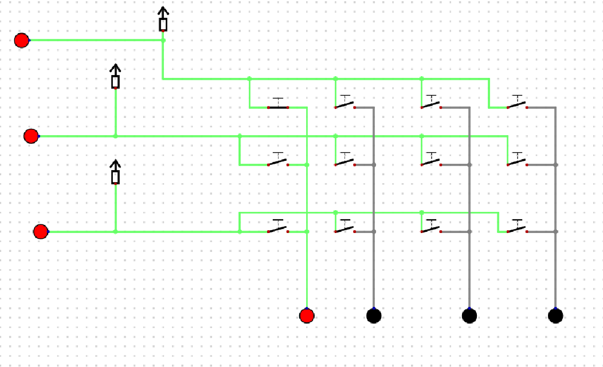
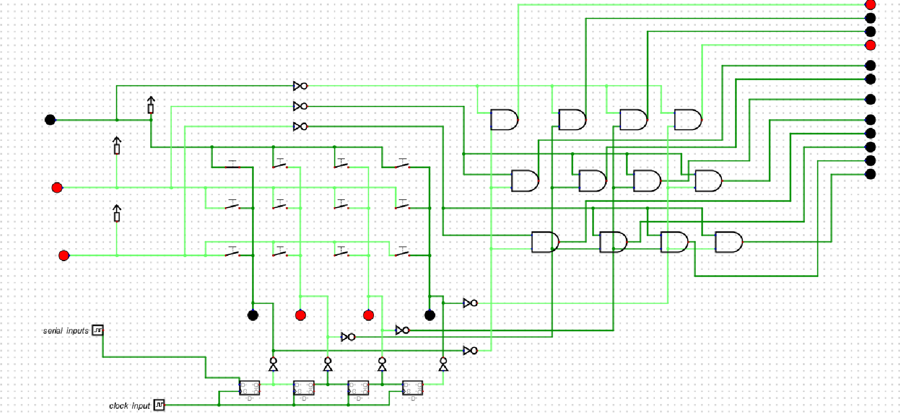
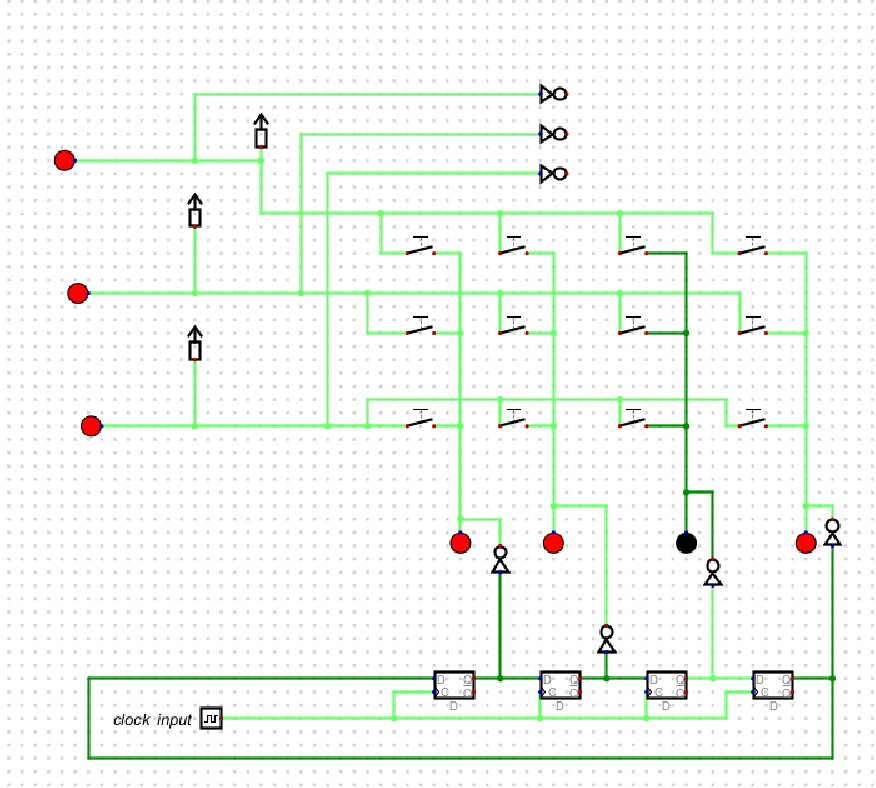
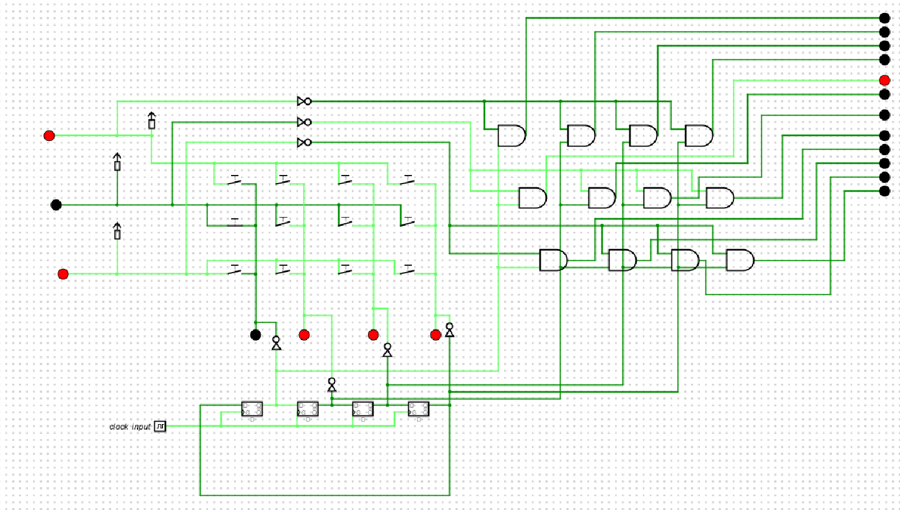
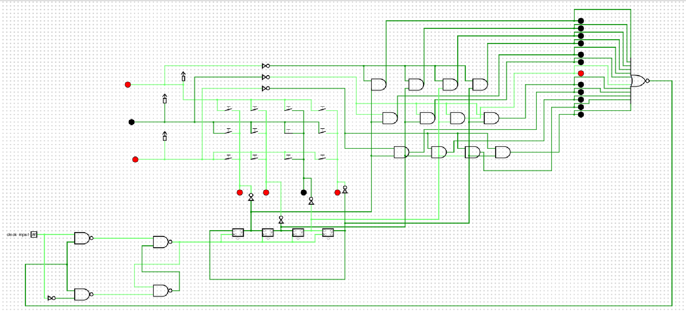

# ⌨️ Keypad Matrix Design & Debugging  
### Using Helmut Neemann Digital Logic Simulator

---

## 📌 About This Repository

This repository documents my **step-by-step learning and debugging process** while designing a **keypad matrix using digital logic** in the **Helmut Neemann Digital Logic Simulator**.

Instead of presenting only the final working circuit, this repository focuses on:
- How the design evolved over time  
- What went wrong at each stage  
- Why certain logic approaches failed  
- How each issue was identified and fixed  

This approach helped me build a deeper understanding of:
- Keypad scanning  
- One-hot encoding  
- Multiple key press detection  
- Latching and state-holding logic  

---

## 🔍 Overview

This repository captures the complete journey of designing and debugging a **keypad matrix using pure digital logic**.

The emphasis is on the **debugging methodology**, not just the result:
- Starting with a basic keypad matrix
- Understanding incorrect and ambiguous outputs
- Introducing one-hot encoding
- Observing multiple key press behavior
- Stabilizing outputs using latching logic

This repository serves as a **learning reference** for digital input systems.

---

## 🛠️ Tool Used
- **Helmut Neemann – Digital Logic Simulator**

---

## 🎯 Objective
- Design a keypad matrix that uniquely identifies key presses  
- Avoid ghosting and ambiguous outputs  
- Hold a key state until the next valid press  
- Understand the difference between combinational and sequential logic  

---

## 🧩 Step 1: Basic Keypad Matrix (Initial Iteration)

In the first iteration, the focus was on **understanding the electrical behavior of a keypad matrix** before adding any decoding or control logic.

### Initial Setup
- A row–column keypad matrix was created using switches  
- Pull-up resistors were added to define default logic states  
- Rows and columns were observed independently  
- A GND connection was used as the reference for key press detection  

The goal at this stage was **not decoding**, but simply observing:

> *What actually happens to rows and columns when a key is pressed?*

---

### 🔎 Observed Behavior

**When no key is pressed**
- Rows and columns remain at logic **HIGH (1)** due to pull-up resistors  

### 📷 Circuit – Keypad Matrix When a key is pressed and GND is connected

**Fig 1.1:**  
Key press behavior when a switch connects a row and column to **GND**.  
The corresponding row and column transition to logic **LOW (0)** during a key press.
 

### 📷 Circuit – Keypad Matrix When a key is pressed without a GND reference

**Fig 1.2:**  
- The corresponding row and column transition to logic **HIGH (1)** during a key press.

This clearly demonstrated that:

> A key press does not generate a signal by itself  
> It only connects a row and a column electrically  

The observed logic level depends entirely on how the matrix is biased  
(using pull-up or pull-down resistors).

---

### ⚠️ Key Insight from This Iteration

Although the matrix worked electrically, it exposed a major limitation:

- Pressing a key created **multiple signal paths**
- Rows and columns became active **simultaneously**
- There was **no unique output** representing a specific key  

In other words:

> The matrix could detect *activity*,  
> but it could not identify *which key* was pressed in a clean and unambiguous way.

---

### ❓ Why This Became a Problem

If this raw matrix output were connected directly to logic or a controller:
- Some of the columns where in Z condition which would be difficult to itterate
- Outputs could overlap  
- Decoding would become unreliable  

This made it clear that **additional encoding logic was required**.

---

### 💡 Introduction to One-Hot Encoding (Conceptual Realization)

While studying keypad matrix behavior, I came across the concept of **one-hot encoding**.

**One-hot encoding principle:**
- Only **one output line** is allowed to be HIGH at any time  
- Each key corresponds to a **unique output line**  
- No two keys share the same active signal  

This concept directly addressed the core issue observed in the first iteration:

> Multiple rows and columns becoming active for a single key press and also the pressence of a Z state.

---

### ✅ Conclusion of Step 1

This initial iteration was critical because it:
- Built a clear mental model of keypad matrix behavior  
- Demonstrated why a keypad matrix alone is insufficient  
- Motivated the need for structured encoding logic  

The next step was to move beyond raw row–column detection and implement  
**one-hot encoded outputs** for reliable key identification.

➡️ *This leads to Step 2: One-Hot Encoding Implementation.*

## 🧩 Step 2: One-Hot Encoding for Column Scanning

After realizing that a basic keypad matrix cannot uniquely identify a key press, the next step was to implement **one-hot encoding** for column scanning.

The goal was to ensure:
- Only **one column is active at a time**
- Columns are scanned sequentially
- Key presses can be mapped deterministically

To achieve this, **D flip-flops (DFFs)** were introduced.

---

## 🎯 Objective of This Step
- Generate a one-hot encoded column signal
- Use sequential logic for controlled scanning
- Convert one-hot signals into **active-low scan lines**
- Study timing and synchronization constraints
- Eliminate simultaneous column activation

---

## 🧠 Initial Design: One-Hot Encoding Using D Flip-Flops

A chain of **D flip-flops** was used to propagate a single logic `1` across column outputs.

Each DFF output represented one column line:

1000 → 0100 → 0010 → 0001

This is the standard **one-hot encoding pattern**, where only one bit is HIGH at any time.

---

## ⏱️ Two-Clock Implementation (Initial Attempt)

To experiment with timing behavior, **two different clock signals** were used:

- **D-input clock**
  - Frequency: **1 Hz**
  - Controls data availability at the D input

- **CLK (flip-flop clock)**
  - Frequency: **3 Hz**
  - Controls state transitions

This setup was used to study **real-world timing effects** in sequential circuits.

---

## ❌ Issue Observed: One-Hot Encoding Failure

**Fig 2.1:**  
One-hot encoding failure when using two unsynchronized clocks.  
Column 1 and Column 4 go HIGH simultaneously.

### Observed Behavior
- Column 2 and Column 3 behaved correctly
- Column 1 and Column 4 became HIGH at the same time
- This violates the one-hot encoding rule

---

## 🔍 Root Cause Analysis

The failure occurred due to:
- Unsynchronized clock domains
- Propagation delay through combinational logic
- Setup and hold time violations in D flip-flops

Because the **CLK (3 Hz)** was faster than the **D input stabilization (1 Hz)**:
- Flip-flops latched unstable data
- Previous and next states were momentarily active together

> This showed that **correct logic alone is not sufficient** —  
> timing must also be correct.

---

## 🔄 NOT Gate Addition for Keypad Scanning Logic

For keypad scanning, **active-low column signals** were required.

Therefore, **NOT gates** were added after the one-hot outputs.

### Conversion Logic
One-hot output: 1000 → 0100 → 0010 → 0001

After NOT gates: 0111 → 1011 → 1101 → 1110

### Why This Is Required
- A `0` selects the active column
- Remaining columns stay HIGH
- Prevents multiple columns from being active
- Enables proper row–column intersection detection

This is the standard **keypad scanning pattern**.

---

## ⚠️ Design Constraint Identified

At this point, it became clear that:
- Synchronizing two independent clocks reliably was not feasible
- Multi-clock designs increased instability
- A **single-clock deterministic solution** was required

---

## ✅ Final Solution: Ring Counter with Preset Initialization

To eliminate synchronization issues, the design was modified to use a **ring counter**.

### Ring Counter Implementation
- D flip-flops connected in a loop
- Output of last DFF fed back to the first
- **Single clock source**
- **First DFF preset to HIGH (1)**

This ensured a known startup state and continuous sequencing: 1000 → 0100 → 0010 → 0001 → 1000 → ...

---

## ✅ Stable One-Hot Encoding Using Ring Counter

**Fig 2.2:**  
Stable one-hot encoding using a ring counter with preset initialization.  
Only one column is active at any time, with no overlap.

---

## 🔁 Active-Low Scan Pattern (Final)

After NOT gate inversion: 0111 → 1011 → 1101 → 1110

This pattern enables:
- Clean column-by-column scanning
- No ghosting
- Reliable key detection

---

## 📚 Key Learnings from Step 2
- One-hot encoding depends on **timing discipline**
- Multiple clocks introduce synchronization risks
- NOT gates are essential for active-low keypad scanning
- Ring counters are ideal for scanning applications
- Presetting ensures deterministic startup behavior

---

## ✅ Conclusion of Step 2

The final design successfully achieved **stable one-hot column scanning** by:
- Abandoning unsynchronized multi-clock logic
- Using a single-clock ring counter
- Presetting the first D flip-flop
- Applying NOT gates for active-low scanning

➡️ *This leads directly to Step 3: Multiple Key Press Detection and Output Stabilization.*

## 🧩 Step 3: Key Press Detection Using Row–Column AND Logic

After achieving stable one-hot column scanning in Step 2, the next objective was to **detect which key is being pressed** and generate a corresponding output.

This step focuses on **decoding the keypad matrix** by combining row and column signals.

---

## 🎯 Objective of This Step
- Detect the exact row–column intersection of a pressed key
- Generate a unique output for each key
- Visually verify correct detection using LEDs
- Ensure decoding works only when the correct column is active

---

## 🧠 Design Approach

To detect a key press:
- **AND gates** were connected between each row line and each column scan line
- Each AND gate represents a **single key position**
- Output of each AND gate drives a corresponding LED

### Logic Principle
A key is considered pressed **only if**:
- The correct column is currently active (from one-hot scan)
- The corresponding row line is active
- Both conditions are true at the same time

This ensures:
- No false triggering
- No ghost key detection
- Deterministic key identification

---

## 📷 Keypad Decoding Using AND Gates

**Fig 3.1:**  
AND-gate-based decoding of keypad rows and columns.  
Each LED represents a unique key and glows only when its corresponding button is pressed.

---

## 🔎 Observed Behavior

- Pressing a key activates:
  - One column (from one-hot scanning)
  - One row
- The AND gate at that intersection goes HIGH
- The corresponding LED turns ON
- All other LEDs remain OFF

This confirmed that:
> Row–column AND logic correctly identifies individual key presses.

---

## ⚠️ Limitation Observed

Although key detection worked correctly:
- The output changed immediately when the column logic changed due to one hot encoding
- If the key was held or released quickly, the output flickered
- There was no mechanism to **hold the detected value**

This highlighted the need for **state retention**.

➡️ This led to the next step: **output latching**.

---

## 🧩 Step 4: Holding the Key State Using a D-Enabled Latch

In this step, a **D-enabled latch** was introduced to **hold the detected key value** until the switch is released.

This is critical for:
- Stable human input systems
- Preventing flickering outputs
- Ensuring downstream logic receives a clean signal

---

## 🎯 Objective of This Step
- Store the detected key output
- Hold the value while the key remains pressed
- Update the output only after the key is released 

---

## 🧠 Design Approach

- The output from the AND gate (key detection) is connected to the **D input**
- The key press signal acts as the **Enable (EN)**
- When EN is HIGH:
  - The latch captures the key value
- When EN goes LOW:
  - The latch holds the previous value

This converts a momentary key press into a **stable output state**.

---

## 📷 D-Enabled Latch for Key Hold Function

**Fig 4.1:**  
D-enabled latch used to hold the detected key value until the key is released.

---

## 🔎 Observed Behavior

- On key press:
  - Correct key output is latched
  - LED remains ON
- While the key is held:
  - Output remains stable
- On key release:
  - Latch disables
  - System becomes ready for the next key press

This ensured:
- No output flickering
- Clean transitions
- Reliable key state retention

---

## ✅ Conclusion of Step 4

Adding a D-enabled latch completed the keypad logic by:
- Stabilizing the decoded output
- Holding the key state reliably
- Making the system suitable for real-world use

---

## 🧠 Overall Key Learnings (Steps 1–4)
- Raw keypad matrices are electrically correct but logically ambiguous
- One-hot encoding requires strict timing discipline
- Ring counters provide reliable sequential scanning
- AND-gate decoding cleanly identifies key presses
- Latching is essential for stable human input systems

➡️ *This completes the core keypad matrix design and debugging process.*

## ✅ Conclusion

This keypad matrix design was developed based on my **own understanding, analysis, and experimentation** with digital logic concepts.  
While the implementation may not be the most optimized or industry-standard solution, the primary objective of this project was **learning through design, testing, and debugging**.

By building the circuit step by step, observing failures, and refining the logic, I gained **deeper insights into digital electronics**, especially in areas such as:
- Keypad matrix behavior
- One-hot encoding and its timing constraints
- Clock synchronization challenges
- Ring counter based scanning
- Row–column decoding using combinational logic
- State holding using latches

This project helped me understand that **correct logic alone is not sufficient**—timing, synchronization, and state control are equally critical in real digital systems.

Most importantly, this hands-on approach strengthened my ability to:
- Analyze circuit behavior
- Identify root causes of incorrect outputs
- Iterate on designs based on observed issues
- Think systematically about digital system design

Overall, this project served as a strong practical foundation in **digital electronics and sequential logic**, and significantly improved my confidence in **designing, testing, and debugging complex logic circuits**.

## Author
**Megha Akku Mathew**  
Digital Logic | Embedded Systems | IoT | Hardware Design 
